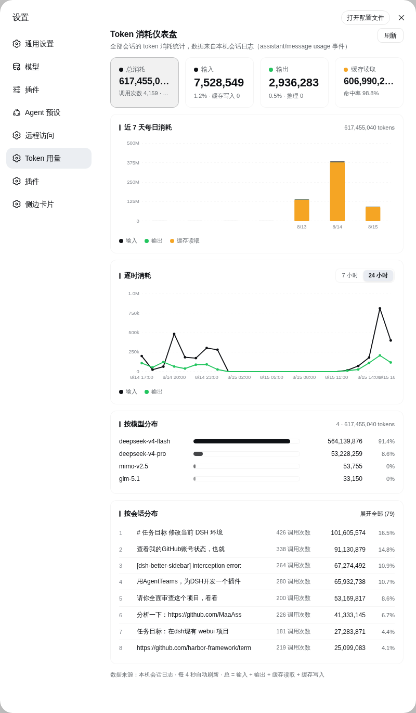
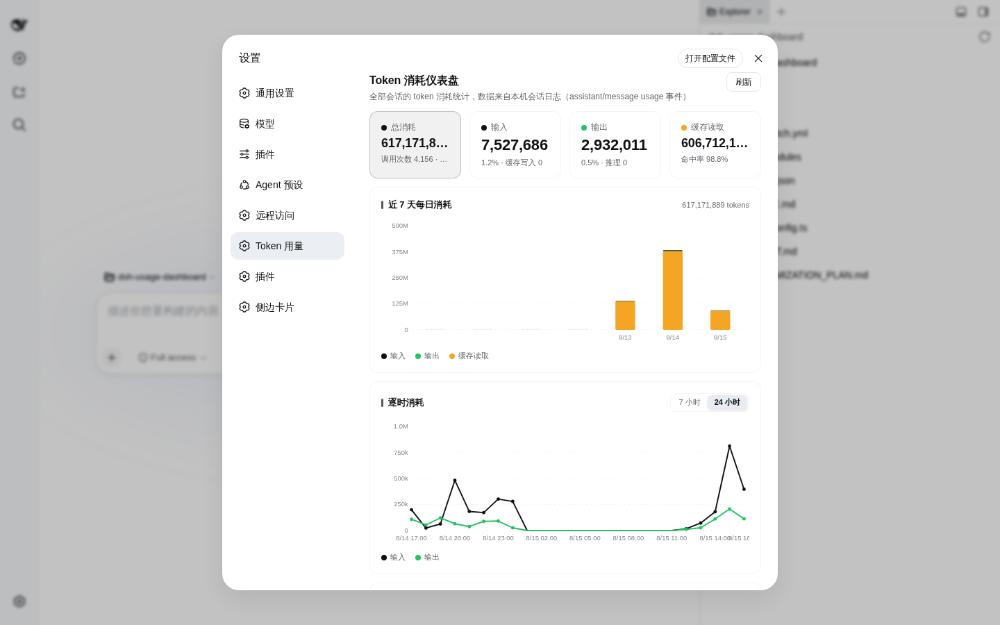

# 📊 dsh-usage-dashboard

> **DSH（DeepSeek Harness）Web 插件 —— 设置页 Token 消耗仪表盘**

在 DSH 的 Web 界面（`http://127.0.0.1:3080`）设置对话框中，一键查看**全部会话**的 Token 消耗：核心指标卡、近 7 天每日趋势、逐时曲线、按模型 / 按会话分布，数据全部来自本机会话日志，真实可追溯、不上传任何外部服务。

[](./LICENSE)
[]


[](https://github.com/xinmo114514/dsh-usage-dashboard)
[](https://github.com/xinmo114514/dsh-usage-dashboard/fork)
[](https://github.com/xinmo114514/dsh-usage-dashboard/issues)
[](https://github.com/xinmo114514/dsh-usage-dashboard/pulls)
[](https://github.com/xinmo114514/dsh-usage-dashboard/pulls)

---

## 目录

- [简介](#简介)
- [仪表盘截图](#仪表盘截图)
- [功能特性](#功能特性)
- [数据来源与统计口径](#数据来源与统计口径)
- [工作原理](#工作原理)
- [快速开始](#快速开始)
- [API 文档](#api-文档)
- [行为与内置常量](#行为与内置常量)
- [隐私与安全](#隐私与安全)
- [项目结构](#项目结构)
- [Roadmap](#roadmap)
- [贡献指南](#贡献指南)
- [许可证](#许可证)
- [联系与支持](#联系与支持)

---

## 简介

**这是什么？** 一个为 DSH（DeepSeek Harness）Web 界面打造的 Cordis 插件。它把散落在 `~/.dsh/sessions/` 下的全部会话日志中的 token 用量聚合起来，在 **设置 → Token 用量** 分区呈现为一个完整的消耗仪表盘。

**解决什么问题？** DSH 本身不提供全局的 token 消耗视图；想知道“近 7 天 / 今天 / 某个模型 / 某个会话花了多少 token”，只能翻原始日志。本插件把这些信息变成打开设置就能看到的图表。

**核心亮点：**

- 📊 **五维聚合**：总量、按日、按小时、按模型、按会话，一次扫描全部折叠
- 📈 **零依赖图表**：SVG 手写堆叠柱状图、双折线图、分布条，不引入任何图表库
- 🛡️ **RAW 日志直读**：直接解压解析 `session.jsonl.zstd`（多帧 zstd），不依赖解释器逐条重放，数据完整可审计
- 🔒 **纯本地统计**：所有聚合只在本机进程内完成，不发送任何外部请求
- 🎨 **主题自适应**：复用 DSH shell 的 `--dsw-alias-*` 设计令牌，明暗主题、窄屏布局自动适配
- 🌐 **中英双语**：内置 zh / en 两套文案，跟随浏览器语言自动切换

## 仪表盘截图

<p align="center">
  
  <br/>
  <em>设置对话框中的「Token 用量」分区：指标卡 + 近 7 天每日堆叠柱状图 + 逐时双折线 + 按模型 / 按会话分布（数据为真实会话日志聚合）</em>
</p>

<p align="center">
  
  <br/>
  <em>仪表盘在 DSH Web 设置页中的实际位置：侧边栏底部齿轮 → 设置 → 左侧「Token 用量」</em>
</p>

## 功能特性

| 功能 | 说明 | 截图 |
|---|---|---|
| 🧮 核心指标卡 | 总消耗 / 输入 / 输出 / 缓存读取，附调用次数、会话数、占比、缓存写入、推理量、缓存命中率；数值按位数自动缩放字号，任何宽度下不截断 | [dashboard.png](./docs/images/dashboard.png) |
| 📊 近 7 天每日消耗 | 输入 / 输出 / 缓存堆叠柱状图，悬停查看当日明细（总数、输入、输出、缓存、调用次数） | 同上 |
| ⏱️ 逐时消耗 | 输入 / 输出双折线图，支持 **7 小时 / 24 小时**窗口切换，悬停查看整点明细 | 同上 |
| 🤖 按模型分布 | 横向条形 + 占比（模型名取自 `assistant/message` 事件的 `data.message.source.model`），品牌色同色系透明度阶梯，排名靠长度表达 | 同上 |
| 💬 按会话分布 | 会话列表（标题 + 调用次数 + tokens + 占比），可「展开全部」查看所有会话 | 同上 |
| 🔔 状态反馈 | 扫描中脉冲徽标、缺失会话警告徽标（悬停显示原因）、手动刷新按钮、空状态 / 错误状态 | 同上 |
| 🌓 响应式布局 | 容器查询自适应：宽容器 4 列 → 常规 2 列 → 极窄 1 列指标卡，手机宽度不横向溢出 | 同上 |

## 数据来源与统计口径

> 仪表盘展示的每一个数字都可追溯到本机的会话日志文件。

- **数据源**：宿主半启动后异步扫描 `~/.dsh/sessions/**/session.jsonl.zstd`（`DSH_HOME` 可覆盖，默认 `~/.dsh`），RAW zstd 直接解析（多帧用 `zstd` CLI 解压，Node 内置 zlib 只能解出首帧）；RAW 解码失败（如仍在写入的尾部帧）自动回退 `sessionQuery.readSession` / `sessionPersistence.readFrom`。
- **统计口径**：`assistant/message` 事件的 `data.usage.{inputTokens, outputTokens, cacheReadTokens, cacheWriteTokens, reasoningTokens}`；`total = input + output + cacheRead + cacheWrite`（不含 reasoning）。
- **模型归属**：事件 `data.message.source.model`（缺失时回退 `data.model`，再缺失记 `unknown`）。
- **会话标题**：取自 `session/title` 事件，缺省回退工作目录 basename，再缺省显示截断的会话 id。
- **实时折叠**：通过 `ctx.on('session/event')` 监听新产生的用量事件，每个会话以 `maxSeq` 水位去重，与扫描结果幂等合并。
- **自愈重扫**：每 60 秒增量重扫一次（防重入锁保证扫描不重叠）；某轮无失败会话时自动清除历史错误标记。
- **前端刷新**：仪表盘挂载期间每 4 秒轮询一次 API，切换分区即停止轮询。

## 工作原理

插件分为两个“半”（与 DSH 插件惯例一致）：

```text
┌──────────────────────────── host 半（Node，src/index.ts）───────────────────────────┐
│  cordis 注入：webServer · sessionQuery · sessionPersistence · timer                    │
│  ┌─────────────┐   RAW 直读    ┌──────────────┐   五维折叠   ┌──────────────┐        │
│  │ 会话日志目录 │ ───────────▶ │ 扫描器（4 并发）│ ─────────▶ │ 内存聚合存储 │        │
│  │ ~/.dsh/sessions │  harness 兜底 │ 60s 自愈重扫  │  实时事件折叠  │  totals/daily │        │
│  └─────────────┘              └──────────────┘              │  hourly/byModel│        │
│                                                             │  /bySession    │        │
│  GET /usage/api/dashboard（仅回环 Host 可访问）◀─────────────┘                │        │
└──────────────────────────────────────────────────────────────────────────────────────┘
                                      │ HTTP（4s 轮询）
┌──────────────────────────── client 半（浏览器，src/client/index.tsx）─────────────────┐
│  slots.inject('settings.section') → 设置对话框左侧「Token 用量」（order 40）              │
│  指标卡 / SVG 图表 / 分布列表 —— 纯 createElement，无 JSX、无图表库依赖                    │
└──────────────────────────────────────────────────────────────────────────────────────┘
```

- **host 半**只依赖 Node 内置模块，所有 DSH 服务通过 cordis 注入列表获得（`export const inject = [...]`），由插件自身声明。
- **client 半**通过 `window.__ModuleLoader__.load({ id, factory })` 注册进 Web shell 的冻结模块表，运行时仅 `require('react')`。
- API 路由注册为 **exact** 路由，可与 `dsh-usage-widget` 等插件的 `/usage/api` 前缀路由共存（webserver 优先匹配 exact 表）。

## 快速开始

### 环境要求

| 依赖 | 版本 |
|---|---|
| [Node.js](https://nodejs.org/) | ≥ 20 |
| 包管理器 | pnpm（npm / yarn 亦可） |
| [zstd](https://github.com/facebook/zstd) CLI | 可选：缺失时 RAW 解压自动回退 harness 读取 |
| DSH Web 环境 | 已运行的 DSH Web 实例（默认 `http://127.0.0.1:3080`） |

### 构建

```bash
# 1. 安装依赖
pnpm install

# 2. 构建（tsdown 双产物）
pnpm build        # → lib/index.js（host 半，Node ESM）
                  # → lib/client.js（client 半，浏览器 CJS，带 sourcemap）

# 开发模式（监听文件变更自动重建）
pnpm watch
```

### 装配到 DSH

**方式 A：patch 文件（持久化，重启后仍生效）**

将本仓库 `cordis.patch.yml` 的内容合并进 DSH profile 的 `cordis.patch.yml`（并将本仓库目录 link 到 profile 的 `node_modules` 下，使 loader 能按 `name` 解析到包）：

```yaml
# cordis.patch.yml
- insert:
    - id: usage-dashboard
      name: 'dsh-usage-dashboard'
```

**方式 B：超级模组注入器（免重启热装配）**

在 DSH 会话中调用注入器工具，运行时加载本插件（host 半 + client 半同时生效）：

```text
dev_install_package {"dir": "<本仓库绝对路径>"}
```

> 提示：`package.json` 的 `dsh.bundle.patch` 字段指向 `./cordis.patch.yml`，构建产物 `files` 已包含 `lib/`、`src/`、`README.md`、`cordis.patch.yml`，可直接作为 bundle 包分发。

### 使用

1. 刷新浏览器，打开 `http://127.0.0.1:3080`
2. 点击侧边栏底部 **齿轮**（设置）→ 左侧导航 **「Token 用量」**
3. 首次打开会自动扫描全部会话日志（右上角显示“正在扫描会话日志…”脉冲徽标），随后图表与分布自动填充，每 4 秒自动刷新

## API 文档

Host 半暴露一个只读 JSON API，供仪表盘（及第三方工具）查询聚合结果：

```text
GET /usage/api/dashboard?range=7d|30d|24h|all&hours=24&top=8
```

**请求参数**

| 参数 | 类型 | 默认值 | 说明 |
|---|---|---|---|
| `range` | `string` | `7d` | 每日序列范围：`7d` / `30d` / `24h` / `all`（`all` 返回全部历史自然日） |
| `hours` | `number` | `24` | 逐时序列小时数（1–168，自动夹取） |
| `top` | `number` | `8` | 按会话分布返回条数（1–200，自动夹取） |

**响应**：`{ "ok": true, "value": { ... } }`；`value` 字段如下：

| 字段 | 说明 |
|---|---|
| `totals` | 全量合计：`input / output / cacheRead / cacheWrite / reasoning / total / calls` |
| `daily` | 按自然日零填充的序列（默认最近 7 天；`range=all` 返回全部） |
| `hourly` | 按小时零填充的序列（默认最近 24 小时） |
| `byModel` | 按模型聚合，`total` 降序 |
| `bySession` | 按会话聚合（含 `title / cwd / lastAt`），`total` 降序，默认 top 8 |
| `scanning / scans / failed` | 扫描状态、累计扫描轮数、最近一轮失败会话数 |
| `rawSessions / harnessSessions` | 通过 RAW 日志 / harness 兜底折叠的会话数（审计用） |
| `foldedEvents / dedupSkipped` | 已折叠的用量事件数、水位去重跳过数（审计用） |
| `lastError / scanError / lastScanAt` | 最近失败详情、灾难级错误、最近扫描时间（诊断用） |
| `sessions / range / time` | 已知会话总数、本次请求的 range、服务端时间戳 |

**安全围栏**：仅**回环 Host**（`localhost` / `127.x.x.x` / `::1`）可访问，非回环请求返回 `403`（防 DNS 重绑定 / 跨站探测）；非 GET 请求返回 `405`。

示例：

```bash
curl 'http://127.0.0.1:3080/usage/api/dashboard?range=7d&hours=24&top=8'
```

```json
{
  "ok": true,
  "value": {
    "totals": { "input": 7506973, "output": 2923767, "cacheRead": 605730560, "cacheWrite": 0, "reasoning": 0, "total": 616161300, "calls": 4144 },
    "daily": [ { "t": 1786204800000, "input": 0, "output": 0, "cacheRead": 0, "cacheWrite": 0, "reasoning": 0, "total": 0, "calls": 0 } ],
    "hourly": [ { "t": 1786705200000, "input": 0, "output": 0, "cacheRead": 0, "cacheWrite": 0, "reasoning": 0, "total": 0, "calls": 0 } ],
    "byModel": [ { "model": "deepseek-v4-flash", "input": 0, "output": 0, "cacheRead": 0, "cacheWrite": 0, "reasoning": 0, "total": 0, "calls": 0 } ],
    "bySession": [ { "id": "<会话 id>", "title": "<会话标题>", "cwd": "<工作目录>", "lastAt": 1786783462748, "input": 0, "output": 0, "cacheRead": 0, "cacheWrite": 0, "reasoning": 0, "total": 0, "calls": 0 } ],
    "scanning": false, "scans": 1, "failed": 0,
    "rawSessions": 78, "harnessSessions": 0,
    "foldedEvents": 4144, "dedupSkipped": 20697,
    "lastError": null, "scanError": null, "lastScanAt": 1786783462748,
    "sessions": 78, "range": "7d", "time": 1786783496254
  }
}
```

## 行为与内置常量

插件无用户可配置项（无需设置界面），以下为源码内置行为：

| 行为 | 值 | 位置 |
|---|---|---|
| 前端轮询间隔 | 4 秒（仅仪表盘分区挂载期间） | `src/client/index.tsx` |
| 自愈重扫周期 | 60 秒（防重入锁） | `src/index.ts` |
| 扫描并发 | 最多 4 个 worker | `src/index.ts` |
| 设置分区顺序 | `order: 40`（在“通用设置”0 与“远程访问”30 之后） | `src/client/index.tsx` |
| 会话分布默认条数 | top 8（可展开至 200） | `src/index.ts`、`src/client/index.tsx` |

## 隐私与安全

- 🔒 **零外发**：所有数据只在本机进程内聚合，不发送任何外部请求、不上报任何遥测
- 🛡️ **API 围栏**：`/usage/api/dashboard` 仅回环 Host 可访问，防 DNS 重绑定与跨站探测
- 👁️ **只读**：插件不修改任何会话文件，仅读取聚合统计

## 项目结构

```text
dsh-usage-dashboard/
├── src/
│   ├── index.ts              # host 半：日志扫描 + 五维聚合 + /usage/api/dashboard
│   └── client/
│       └── index.tsx         # client 半：设置页 section（settings.section 槽）+ SVG 图表
├── cordis.patch.yml          # bundle 层 loader 条目（id: usage-dashboard）
├── tsdown.config.ts          # 双产物构建配置（host ESM + browser CJS）
├── UI_AUDIT.md               # 界面审计报告（布局 / 对比度 / 交互态）
├── UI_OPTIMIZATION_PLAN.md   # UI 优化方案（设计基线 / 响应式验收目标）
├── docs/
│   └── images/
│       ├── dashboard.png            # 仪表盘全览截图
│       └── dashboard-context.png    # 仪表盘在设置页中的位置截图
├── lib/                      # 构建产物（pnpm build 生成，勿手改）
└── package.json
```

## Roadmap

- [ ] 时间范围切换 UI（近 7 天 / 30 天 / 全部历史）
- [ ] 数据导出（CSV / JSON 报表）
- [ ] 消费预算提醒（日 / 周 / 月阈值告警）
- [ ] 按会话的时间线视图（展开单个会话的逐次调用明细）
- [ ] 更多语言文案（现有 zh / en 字典结构已就绪）
- [ ] 发布到 npm / 插件市场，支持 `pnpm add` 一键安装

> Roadmap 为计划项，欢迎在 [Issues](https://github.com/xinmo114514/dsh-usage-dashboard/issues) 中提议或认领。

## 贡献指南

欢迎任何形式的贡献（bug 报告、功能建议、代码、文档）。流程如下：

1. **Fork** 本仓库，并 clone 到本地
2. 创建功能分支：`git checkout -b feat/my-feature`
3. 提交改动：`git commit -m "feat: ..."`（建议遵循 Conventional Commits）
4. 推送分支：`git push origin feat/my-feature`
5. 发起 **Pull Request**，描述改动内容与验证方式

**开发提示**：改动后运行 `pnpm build` 确认双产物构建通过；涉及 UI 的改动请同步更新 `UI_AUDIT.md` / `UI_OPTIMIZATION_PLAN.md`（如适用）。

## 许可证

[Unlicense](./LICENSE) —— **公有领域（public domain）授权，最开放的自由许可之一**：任何人可自由复制、修改、分发、商用，无需署名、无需保留版权声明，作者不提供任何担保。完整文本见 [LICENSE](./LICENSE)。

## 联系与支持

- 问题与建议：[GitHub Issues](https://github.com/xinmo114514/dsh-usage-dashboard/issues)
- 作者 / 维护者：[心魔才不是女孩子呢](https://space.bilibili.com/359100532)（B 站同名）
- 主页 / 文档：`<项目主页或文档地址>`
- 交流群 / 社区：`<社区链接>`

---

<p align="center">
  <sub>Made with 💙 for the DSH community · 数据不出本机，用量尽在眼前</sub>
</p>
